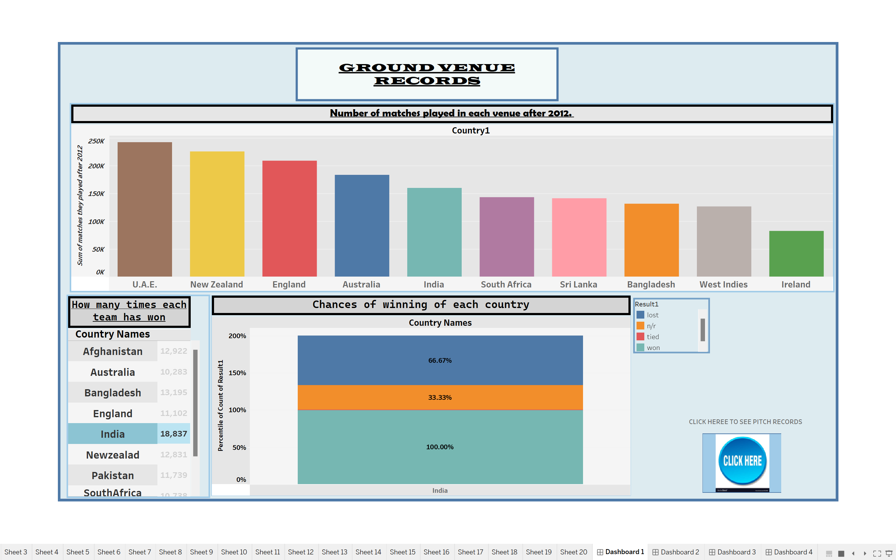
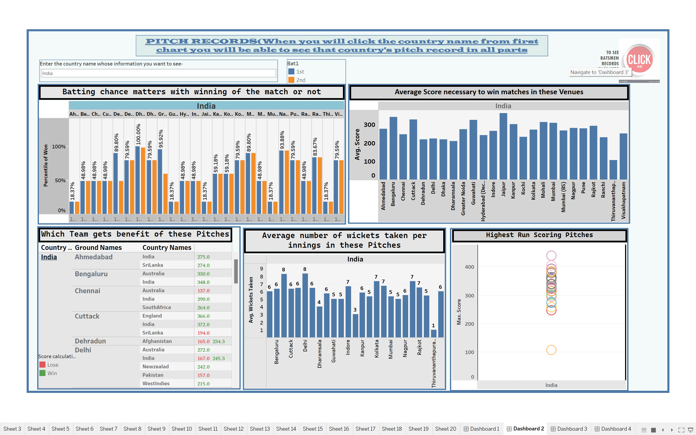
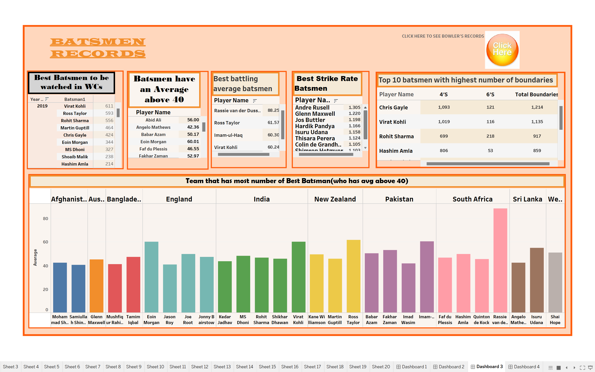
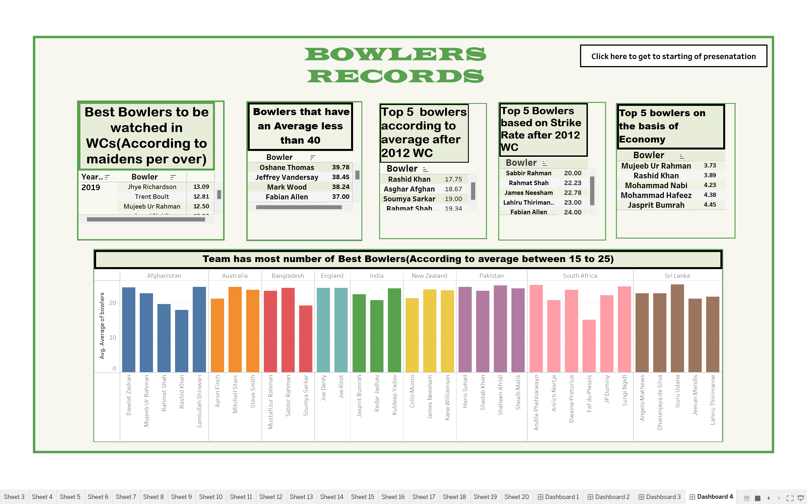

# CricketWorldCupAnalysis-Tableau

## Introduction
Welcome to the Cricket World Cup Analysis Tableau project! This project aims to analyze and visualize data related to the Cricket World Cup using Tableau. By leveraging interactive dashboards and visualizations, we can gain insights into various aspects of the tournament, including team performance, player statistics, match outcomes, and historical trends.

## Data Sources
The data used in this project is sourced from reputable sources such as:
Kaggle: Hosts various datasets related to cricket, including match results, player performances, and team rankings.

## Features
1. Team Performance Analysis
Explore the performance of cricket teams participating in the World Cup tournaments. Analyze metrics such as win-loss records, batting averages, bowling averages, and run rates.
2. Player Statistics Visualization
Visualize player statistics and performances in the Cricket World Cup. Explore batting, bowling, and fielding statistics for individual players and identify standout performers.
3. Match Insights and Trends
Analyze match outcomes, trends, and patterns over different World Cup tournaments. Explore factors such as match venues, toss outcomes, innings totals, and match results.
4. Historical Comparison
Compare performance metrics and statistics across different World Cup tournaments and teams. Identify trends and changes in team strategies, player performances, and overall tournament dynamics over time.

## Analysis
1. First, we will remove all the null values and replace them in excel itself by find and replace method and save the new files for filename ODI_match-results.csv and ODI_match-totals.csv files
2. Also I sorted both the files in serial number wise in excel itself by sort and filter.
3. Now we will import pandas and read all the files downloaded in python.
4. Gather the data of world cup venues, here 16 countries are given so we will gather their data separately.
5. Visualisation of the number of matches played in each venue after 2012. For this question we used Tableau, from the Ground_Averages file I inserted the country name in columns and sum of matches they played after 2012 in rows. Dragged country in colour so that we can see every country in different colours and change the format of the sheet.
6. Now next question is how many times each team has won. For this question first we will cross join the Ground_Averages and ODI_Match_Totals file and after going to the next sheet we will drag the country name to rows and on its side result . We will filter the result part as won and change its measure to count to see the number of won in each country.
7. Now next question is chances of winning of each country. For this question drag country names to columns and filter those country who are active in world cup and in rows we will drag count of results of win, loss, n/r and tied and add percentile calculation to it and the from show me select stacked bar to show whole result in that form and now we can see results in different colours and from that chances of winning can also be analysed.
8. Now next question is if batting chance matters with winning of the match or not. In tableau cross join ODI_match_results file with ODI_match_totals files by creating calculation and then in the next sheet drag Bat to columns and percentage of won in rows and change the mark to graph to see graph visualisation of it. Also drag bat to colours to see the graph of both chances of winning when cricketers bats first and second in different colours. We will also drag ground names to columns to analyse each pitch. In this visualisation we also grouped the ground location according to the country where it is located to see the analysis of each pitch country wise.
9. Now next question is average Score necessary to win matches in these Venues. For this question first we will split score columns in tableau to get whole scores that have been scored till now in ODI, in this question also we will group the ground into the countries where they are located. Then we will drag the group and ground names to columns and score to row. We will change the score to dimension and its data type to the whole number. When we drag  it to row we will change its dimension to average to see average scores scored in each pitch to get good results.
10.In next question “Which Team gets benefit of these Pitches”. We will drag groups made for different countries ground, ground and all country names who play matches in rows. We will make a kpi through a calculated field to highlight the teams which will be benefited to win in these pitches through their average scores in green and which will lose in red and which will have neutral chances in blue. We will drag the calculated field made in colours to see the scores in different colours and average score made by those teams in the respective pitches in text.
11. Question regarding pitches that is average number of wickets taken per innings in these Pitches. We will drag the group for country wise pitches and ground location in rows and from the score we separated the wickets taken in each match we will drag those wickets taken in columns and  change its measure to average and change the mark to bar. We will drag average wickets taken to text also.
12. Next question is to take out “ highest run scoring” among all. For that we will drag country wise groups of pitches to rows and score made on those pitches in columns and change the measure to maximum to see max score made on those pitches we will drag ground names to colours and change the visualisation to circle plot to see which pitch is highest run scoring among all country wise.
13.Now we will make dashboard of the first part. In 1st dashboard we will include the first three sheets which tells information about the ground of the venue. We will create an action between sheet 2 and three when we will click on its results throughout the year in its right-hand side. In the second dashboard we will include all the other 5 sheets which have pitch regarding information and title it the same. We will create a text search by parameter and calculated field for sheet 4 to search the country whose pitch information we want and then we will create an action for source sheet 4 to target rest of the sheets so that when we select the country name in that sheet, we will get pitch regarding information in whole graphs present there regarding that country.
14. Now we will go through batsmen information, we sorted the data player wise according to its total runs, number of balls he faced, number of 4s,6s , its average from 2013- 2019 WCs, and its strike rate according to runs and ball faced by him.
15. Dragged batsman folder beside ground_averages to have many to many relationships and removed all values in which had null values which were the details about the batsman who did not bat.
16. Visualisation of questions regarding batsmen in Tableau. Now regarding batsman, we come to first question that is who were the best batsmen in world cups in 2013-19-
Dragged filtered year of world cups in rows as it had all the year information from 1999 but we only wanted data for after 2013 and dragged batsman data to rows and filtered it to top 10 according to runs it had score to see best batsmen and runs to text to see total runs made by that batsman.
17. Now next question about “Batsmen have an Average above 40”. In this part we will add the sorted data by relating it with batsman data in which average is taken out already through excel. We will drag the player name to rows and sum of its average beside it and text mark. We will filter out the player names by assigning conditions in the filter whose average is > 40.
18. Third question in batting records are “Top 5 Batting Average”. For this drag player name to rows and sum of its average beside it like last question just in this case we will filter out the player name according to top 5 batsmen according to their average.  
19. Next question is to take out who has the best batting average. From the above visualisation it can be seen that Rassie van der Dussen has the best average.
20. Next for top 5 batsmen on the basis of strike rate. We put some strike rate to rows and text and filter players to top 10 according to sum of strike rate and put it in row in text form.
21. For the next question for best batsman with best strike rate we can analyse from the previous chart that it is Jason Behendorff.
22. Next question is to find out top batsmen for most number of boundaries. First we will create a calculated field to aggregate the number of 4’s and 6’s as total boundaries. After this we will drag players names which we will filter out as top 10 and drag it to  columns and put all the measure values that are 4's, 6’s and total boundaries to columns.
23. For the last question regarding batsmen that is to analyse the team with the greatest number of batsmen.We will create a group by player name in which we will group them according to their teams and drag it to columns and and player names to its side in columns and sum of its average to rows. We will filter out rows to see player names according to the average>30, then we can count and see who has the best batsmen in more numbers.
24. Now we will create the dashboard and all sheets regarding batsmen will be dragged here. Now we will drag a navigate button in the second dashboard to create a button to get navigated to the batsmen records sheet.
25. Now we will go through bowlers data, first I will sort the data by keeping the data of those players who have bowl and sorting it in the manner that how many overs they have played, from which we will take out number of balls, runs they have given in these years, maiden overs given by them, their strike rate, average and economy.
26. We will drag the sorted data in tableau with the relationship to the ground_averages file.
27. Visualisations of questions regarding bowlers in tableau. In bowlers’ part first question is to find best bowlers in the world cups. For this part we will create a calculated field of maidensperover to see how many maidens they have given according to balls this will tell that they have given most a smaller number of runs to other teams. In calculated field we will write “([Mdns]*6/[No. of Balls])*100”. After this we will drag the year of world cups by the start date to rows and bowlers beside it and drag calculated field that we create to text and its measure to average to see average maidens they have given in each ball in each match. And filter bowlers name by top 10 names according to maidens per over.
 28. Now next questions is, to find the bowlers who have average less than 40. For this also we create a calculated field titled “Average of bowlers” in which the formula will be” [Runs (Sheet1)]/[Wkts (Sheet1)]”. We will drag bowler's name to rows and average calculated field to text and change its measure to average to see average number of Average bowls played by bowlers and sort it in descending order.
29.  For next question that is top 5 bowlers based on average. We will filter the bowler's name according to average scored by each bowler and since bowlers who have less average are more successful so we will filter data by bottom 5 to see top 5 bowlers according to average.
30. Next question is to find the best bowler according to average, so from previous visualisation we can determine the best bowler.
31. Next question is to find top 5 bowlers according to strike rate. For this visualisation, We will create a calculated field of strike rate and write the formula “[No. of Balls]/[Wkts (Sheet1)]”. We will drag bowler's name to rows and filter it according to bottom 5 to see players who have top 5 strike rates as these should be less for a good bowler. After this drag the calculated field is created to text to see their numbers. We will change the number format to 2 decimal places.
32. For the next question that is to see the best bowler according to strike rate we can visualise it from the previous question.
33. Next question is which bowler have best economy. Good bowlers have less economy, so we will drag   bowler's name to rows and filter it according to bottom 5 economy average according to their matches, after this we will drag economy to text to see their numbers and from that we can analyse bowler with best economy.
34. Now the last question is to team wise analyse which have a greater number of best bowlers,
For this we will first group the bowlers according to their teams in which they are by creating a group. We will analyse the best bowlers according to average between 15 and 35. After this we will drag the team group which we made and bowlers to column and average each bowler have in rows and from show me create a graph of it to visualise those bowlers with average in given range. We can then analyse the number of good bowlers by counting the number of graphs in each team.
Now lastly, we will make a dashboard of bowler’s detail, we will drag all the sheets in the fourth dashboard and align it accordingly. After this we will create a navigation button in batsmen records to navigate it to bowler data. We will create another navigation text from the bowler's data to reach the starting of the presentation.

## Conclusion
It can be concluded from the project that-
1. India and New Zealand have won the most among all teams so they have high chances of winning in every world cup and can be strong competitors.
2. Sri Lanka and West Indies need to work upon them as they are the teams which according to analysis have highest chances of losing.
3. In tossing system according to analysis, the team which wins the toss should take bat first and create a good score and then defend as mostly in this order teams win in past matches.
4. According to records till 2019, Eoin Morgan from England Team has highest average, Andre Rusell from West Indies Team has highest strike rates, Chris Gayle from West Indies and Virat Kohli from India has made the highest number of boundaries.
5. According to records till 2019, Rashid Khan of Afghanistan team has best average, Sabbir Rahman of Bangladesh team  has best strike rate and economy.
6. Most number of best batsmen has been found in India while most number of best bowlers have been found in South Africa.

## Contact Information
For inquiries or support regarding this project, please contact Arsh Zehra at zehrarsh@gmail.com.

